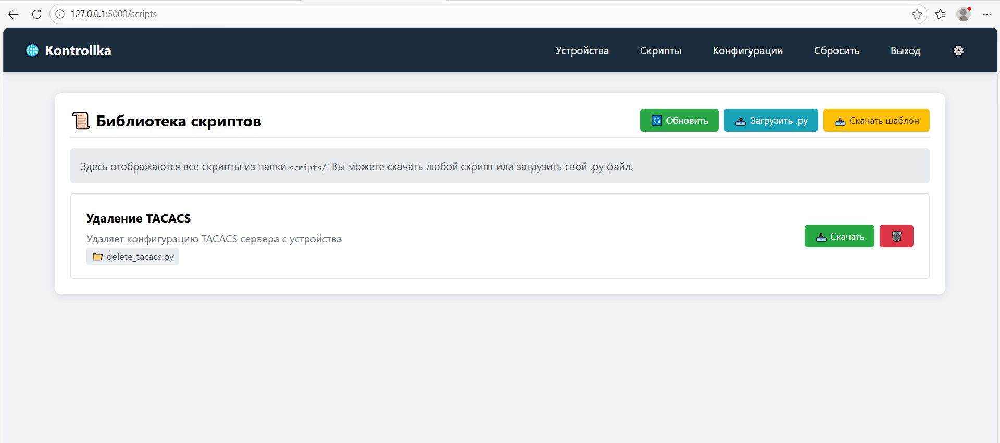

# Kontrollka Lite

🌐 Простой веб-инструмент для управления сетевым оборудованием

## Возможности

- 📱 Веб-консоль для Huawei, Cisco, Juniper, Arista
- 👥 Групповая консоль для выполнения команд на нескольких устройствах сразу
- 📜 Добавляй скрипты автоматизации на Python (образец уже вложен)
- 💾 Сохранение и просмотр конфигураций
- 🔌 Общий логин/пароль для устройств (меняется в web)
- 🌐 Ручное добавление устройств сразу в web


- Используется вместо/вместе (с) Ansible!
- Идеален для небольших организаций (срок внедрения - 1 час) 
- Не требует дополнительного обучения

Открой браузер: http://localhost:5000
Логин: admin
Пароль: admin

## Скриншоты

### Главный экран


### Добавление устройства


### Групповая команда


### Управление скриптами


### Настройка подключения


### Сохраненные конфигурации


## Быстрый старт

```bash
# Клонируем
git clone https://github.com/Baymirzaev-A/kontrollka-lite.git
cd kontrollka-lite

# Устанавливаем зависимости
pip install -r requirements.txt

# Запускаем
python app.py

